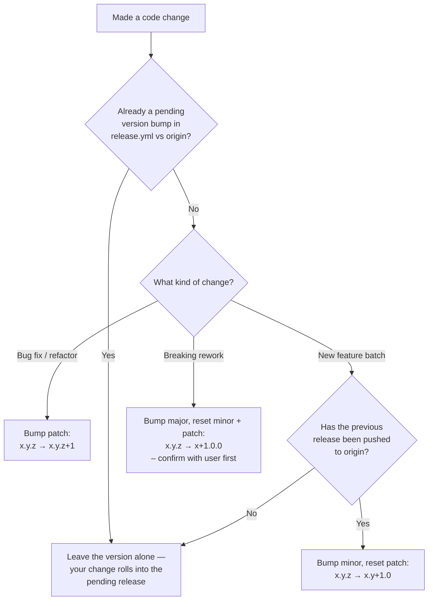
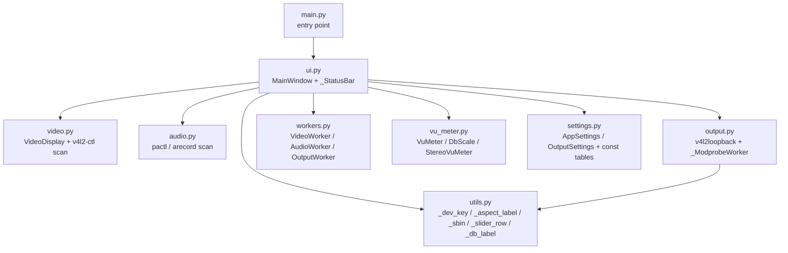
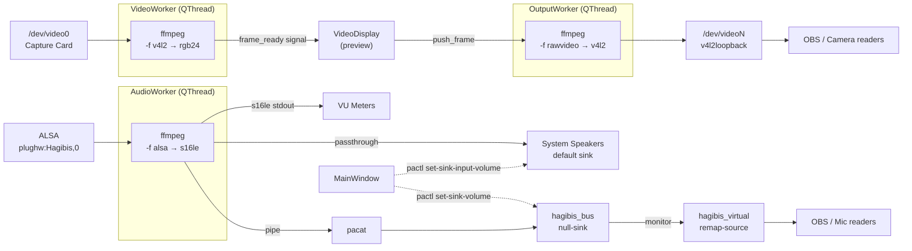

# Agent guide

> If you are an AI coding agent (Claude Code, Cursor, Codex, Aider, Copilot
> agents, etc.) opening this repo for the first time, **start here**.

## Read the README first

Before doing any work, read [README.md](README.md) in full. It is the
canonical context document for this project and covers:

- **Hardware context** — capture-card chipset, V4L2 / ALSA addressing,
  supported formats and resolutions.
- **What the app does** — the runtime behaviour of every UI control.
- **Project layout** — the file tree and a per-file description of every
  Python module.
- **Dependencies** — Python + system packages required to run or build.
- **UI walkthrough** — what each tab and indicator means.
- **Profiles** — the named-profile system and what each profile stores.
- **Video display options** — every scale and crop mode.
- **Audio** — passthrough, virtual mic, and the per-channel volume model.
- **Output** — v4l2loopback wiring and virtual camera lifecycle.
- **Known quirks and gotchas** — landmines you will hit if you do not
  read this section.

If anything in the rest of this file contradicts the README, the README
wins — and that means the README is stale and you need to fix it
(see [Keep the README up to date](#keep-the-readme-up-to-date) below).

---

## Why a separate AGENTS.md

The README documents the project for **humans** — what it is, how to run
it, how it behaves. This file documents the project for **automated
contributors** — what rules you must follow when changing code, where
the version lives, how to write diagrams, how to ship a release.

Conventions established here apply to every agent and every turn,
including future invocations that have no memory of this conversation.

---

## Keep the README up to date

**The README is the canonical context document for the project.** Whenever
you change something that affects how a future assistant should reason
about the code, update the README in the same change. That includes:

- File splits, renames, or new modules → update [Project layout](README.md#project-layout)
  and the per-file sub-sections.
- New `AppSettings` / `OutputSettings` fields → update the
  [AppSettings fields](#appsettings-fields-current) block in this file
  and the [Profiles](README.md#profiles) "what each profile stores" table
  in the README.
- New ffmpeg / pactl invocations or worker threads → update
  [Architecture](#architecture) in this file and the relevant worker
  description in the README.
- New UI tabs, controls, or status indicators → update the
  [UI walkthrough](README.md#ui-walkthrough) and
  [What the app does](README.md#what-the-app-does).
- New external dependencies → update the [Dependencies](README.md#dependencies)
  table.
- New design decisions or non-obvious quirks → update [Key design decisions](#key-design-decisions)
  in this file or [Known quirks and gotchas](README.md#known-quirks-and-gotchas)
  in the README.

If a change makes any part of the README or this file stale, fix it in
the same commit — do not leave it for "later." A stale doc is worse than
a missing one because future assistants will trust it.

---

## Always use Mermaid for diagrams

Any flow, dependency, state machine, sequence, or architecture diagram
added to README.md, this file, or any other markdown doc in the repo
must be a fenced ```mermaid``` block. Never an ASCII-art box drawing,
never an embedded image, never a link to an external diagramming tool.
Mermaid renders natively on GitHub, stays diffable in PRs, and can be
updated in-place when the underlying code changes. Examples already in
this file: the [Architecture](#architecture) runtime graph, the
[Module dependency graph](#module-dependency-graph), and the
[release version decision flow](#bump-the-version-in-releaseyml).

---

## Bump the version in release.yml

The release version lives in [`.github/workflows/release.yml`](.github/workflows/release.yml)
on the `default:` line of the `workflow_dispatch` input. **That line is
the single source of truth.** It serves two purposes:

1. It pre-fills the version field for manual `workflow_dispatch` runs.
2. It is the version used by the **push trigger** — every push to `main`
   re-reads this line and, if the tag doesn't already exist, cuts a new
   release automatically. If the version hasn't changed since the last
   release, the workflow no-ops (no rebuild, no duplicate tag).

**Update this number as part of the same change that introduces the
feature or fix** — do not leave it for a separate "version bump" commit,
because on push the bump *is* what triggers the release. Versioning is
strict semver `{major}.{minor}.{patch}`:

| Bump | When |
|---|---|
| **major** | Almost never — only for a breaking, top-to-bottom rework |
| **minor** | A chunk of new features (e.g. virtual mic, profile system, output tab) |
| **patch** | A bug fix, small tweak, or refactor with no user-visible behaviour change |

Rules:

- **Never go backwards.** The new version must be strictly greater than
  whatever is currently in the file. Always read the file first.
- **Bumping minor resets patch to 0.** `1.4.7` → next minor is `1.5.0`,
  not `1.5.7`.
- **Only bump if the file hasn't already been bumped in the current
  unpushed work.** Before changing the number, check whether the version
  in `release.yml` already differs from the version on `origin/main`
  (e.g. `git diff origin/main -- .github/workflows/release.yml`). If
  someone — including a previous agent turn — has already raised the
  number for this batch of work, **inherit that pending version** instead
  of bumping again.
- **Minor bumps generally happen only after the previous version has been
  pushed to origin.** If the local branch still has an unpushed minor
  bump (say `1.4.0 → 1.5.0`), additional features added to that same
  unpushed batch should NOT bump again to `1.6.0` — they roll into the
  pending `1.5.0`. Patch fixes piled on top of an unpushed minor bump
  also stay at `1.5.0` until the release is cut. Only after `1.5.0` is
  pushed and tagged does the next feature batch earn `1.6.0`.

Decision flow for any change:



---

## What this project is

A PyQt6 GUI monitor for USB capture cards on a Linux desktop. Not a recording
tool — purely live monitoring, image control, optional audio passthrough,
virtual camera output (v4l2loopback), and virtual microphone (PulseAudio).
All settings are organised into named profiles.

## Code organisation

The codebase is split by functional area (see [Project layout](README.md#project-layout)
for the full file tree):

| File | Role |
|---|---|
| `main.py` | Entry point only — `QApplication` + `MainWindow` |
| `ui.py` | `MainWindow` (everything UI-side) + `_StatusBar` |
| `video.py` | `VideoDisplay` widget + V4L2 device scanning / cap query |
| `audio.py` | PulseAudio / ALSA device scanning |
| `output.py` | v4l2loopback discovery / load / unload + `_ModprobeWorker` |
| `settings.py` | `AppSettings` + `OutputSettings` dataclasses + constant tables |
| `utils.py` | Small shared helpers (`_dev_key`, `_aspect_label`, `_sbin`, `_slider_row`, `_db_label`) |
| `workers.py` | `VideoWorker`, `AudioWorker`, `OutputWorker` — all three `QThread` subprocess drivers |
| `vu_meter.py` | `VuMeter`, `DbScale`, `StereoVuMeter` |

`MainWindow` in `ui.py` is intentionally monolithic — it owns every widget
and every worker, and orchestrates profile load/save, stream restarts,
real-time volume application, and the dirty-state dialog. Splitting it
further would require restructuring methods into mixins or per-tab
controllers, which would be a behavioural change rather than reorganisation.

### Module dependency graph



Notes:
- `workers.py`, `vu_meter.py`, `video.py`, `audio.py`, and `settings.py` have
  no project-local imports — they only depend on PyQt6, numpy, and stdlib.
- Only `ui.py` reaches across modules to wire things together; nothing
  outside `ui.py` depends on `MainWindow`.

## Architecture



Three long-lived ffmpeg subprocesses (video, audio, output); one per worker.
Workers communicate back to the main thread exclusively via Qt signals.

## Settings / profile system

All profile-able state lives in the `AppSettings` dataclass (flat, no nesting).
The three canonical operations are:

```python
settings = _collect_settings()         # UI → struct
_apply_settings(settings)              # struct → UI + restart streams
_save_to_disk(settings, profile_name)  # struct → INI file (single QSettings obj)
settings = _load_from_disk(name)       # INI file → struct
```

Profile INI files live in `~/.config/HagibisMonitor/profiles/`. The main
`HagibisMonitor.ini` stores window geometry and output settings (device,
resolution, pixel format, fps). **Never write profile data to the global
QSettings** — it breaks the profile separation.

Output is always loaded with `enabled=False` regardless of the saved value.

## AppSettings fields (current)

```python
@dataclass
class AppSettings:
    scale_mode: str = "fit"
    crop_mode: str = "full"
    bg_color: str = "#1f1f1f"
    video_device: str = "/dev/video0"
    video_fmt: str = "mjpeg"
    video_res: str = "1280x720"
    video_fps: int = 30
    brightness: int = 50
    contrast: int = 50
    saturation: int = 50
    hue: int = 50
    audio_device: str = "plughw:Hagibis,0"
    audio_enabled: bool = True
    mono_mix: bool = False
    passthrough: bool = False
    volume_db: int = 0
    volume_l_db: int = 0
    volume_r_db: int = 0
    output_scale_mode: str = "fit"
    output_crop_mode: str = "full"
    pan_x: float = 0.0
    pan_y: float = 0.0
    zoom: float = 1.0
```

## Key design decisions

- **ffmpeg, not OpenCV** — OpenCV was not installed; ffmpeg handles MJPEG and
  YUYV without extra libraries.
- **ffmpeg, not sounddevice/pyaudio** — ffmpeg reads ALSA directly and outputs
  raw s16le PCM for numpy.
- **`asplit` for VU + passthrough + virtual** — avoids opening the ALSA device
  multiple times.
- **`plughw:Name,N` not `hw:N,N`** — name-based, survives USB re-enumeration;
  `plughw` allows format conversion via ALSA's plugin layer.
- **pacat for virtual mic** — more reliable than ffmpeg writing directly to
  a named PulseAudio sink.
- **PA modules are persistent** — `hagibis_bus` and `hagibis_virtual` are never
  unloaded by `AudioWorker.run()`. `_find_existing_modules()` reuses them on
  restart. `teardown()` is called explicitly only on output-disable or close.
  This prevents OBS from losing its microphone device on volume/mono changes.
- **`pactl set-sink-volume hagibis_bus`** — more reliable than
  `set-source-volume hagibis_virtual` in PipeWire's PulseAudio compat layer.
  Targeting the null-sink directly ensures the monitor output (and thus the
  virtual source) carries the correct volume.
- **`pactl set-sink-input-volume` for passthrough** — same approach, but
  targeting the ffmpeg sink input found by PID polling.
- **Python-side gain for VU** — `AudioWorker` multiplies raw PCM by the linear
  gain each chunk, so VU meters respond instantly while dragging sliders.
- **`v4l2-ctl` subprocess for image controls** — fire-and-forget `Popen`;
  all values re-applied via `_apply_v4l2_all()` on profile load.
- **`paintEvent` rendering in `VideoDisplay`** — `setPixmap` can only fill
  the full label bounds; using `QPainter.drawPixmap` at a computed `QPoint`
  allows area-constrained scale modes with background colour filling the rest.
- **Single QSettings object per save** — previously, calling helper functions
  that each created their own QSettings object caused sync() to overwrite
  each other. All writes now go through one object before sync().
- **In-memory dirty tracking** — changes update `self._dirty` but do not write
  to disk. Explicit Save / close-event saves flush to disk. This prevents
  accidental profile corruption while experimenting.
- **v4l2loopback without `exclusive_caps`** — loaded without `exclusive_caps=1`
  so OBS and other readers see all standard V4L2 resolutions in their device
  settings, not just the one currently being written.
- **150 ms gap on output resolution change** — `_restart_output()` stops the
  OutputWorker, waits 150 ms (for OBS to process `V4L2_EVENT_SOURCE_CHANGE`),
  then starts a new worker at the new resolution.

## Things not yet implemented

- Auto-detecting the PulseAudio source name for audio passthrough (currently
  uses `plughw:` ALSA direct; switch to a PipeWire virtual device if blocked).
- Recording / snapshot functionality.
- Detection of whether the capture card is actually sending a valid signal.
- Appearance/theming tab.

## Hardware constants (defaults, all overridable via UI)

```python
AppSettings.video_device  = "/dev/video0"
AppSettings.audio_device  = "plughw:Hagibis,0"
AudioWorker.SAMPLE_RATE   = 48000
AudioWorker.CHUNK_FRAMES  = 1024
AudioWorker.BUS_SINK      = "hagibis_bus"
AudioWorker.SOURCE_NAME   = "hagibis_virtual"
```

## How to restart streams from code

```python
win._restart_video()   # stops VideoWorker, starts fresh with current cap_params()
win._start_audio()     # stops AudioWorker, starts fresh with current UI state
win._restart_output()  # stops OutputWorker, waits 150 ms, starts fresh
win._apply_v4l2_all()  # re-applies all image control sliders to hardware
```

## How to load / save a profile from code

```python
s = win._load_from_disk("GBC")   # read GBC.ini → AppSettings
win._apply_settings(s)           # apply to UI + restart streams
win._save_to_disk(win._collect_settings(), "GBC")  # write current UI → GBC.ini
```
