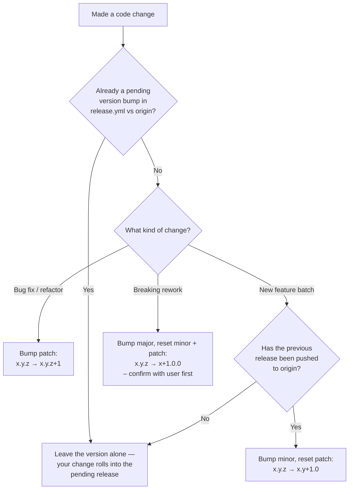
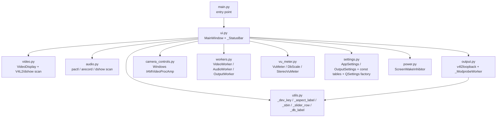
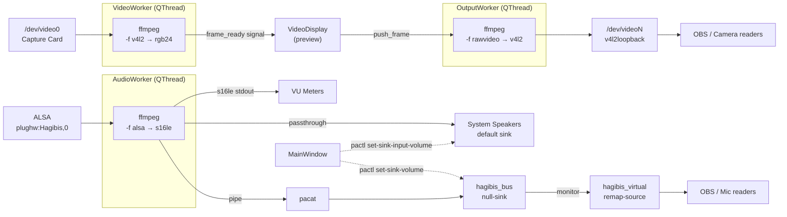
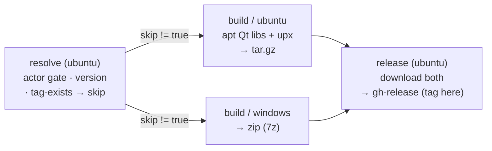

# Agent guide

> If you are an AI coding agent (Claude Code, Cursor, Codex, Aider, Copilot
> agents, etc.) opening this repo for the first time, **start here**.

## Read the README first

Before doing any work, read [README.md](README.md) in full. It is the
canonical context document for this project and covers:

- **Hardware context** — capture-card chipset, V4L2 / ALSA addressing,
  supported formats and resolutions.
- **What the app does** — the runtime behaviour of every UI control.
- **Project layout** — the file tree and a per-file description of every
  Python module.
- **Dependencies** — Python + system packages required to run or build.
- **UI walkthrough** — what each tab and indicator means.
- **Profiles** — the named-profile system and what each profile stores.
- **Video display options** — every scale and crop mode.
- **Audio** — passthrough, virtual mic, and the per-channel volume model.
- **Output** — v4l2loopback wiring and virtual camera lifecycle.
- **Known quirks and gotchas** — landmines you will hit if you do not
  read this section.

If anything in the rest of this file contradicts the README, the README
wins — and that means the README is stale and you need to fix it
(see [Keep the README up to date](#keep-the-readme-up-to-date) below).

---

## Why a separate AGENTS.md

The README documents the project for **humans** — what it is, how to run
it, how it behaves. This file documents the project for **automated
contributors** — what rules you must follow when changing code, where
the version lives, how to write diagrams, how to ship a release.

Conventions established here apply to every agent and every turn,
including future invocations that have no memory of this conversation.

---

## Keep the README up to date

**The README is the canonical context document for the project.** Whenever
you change something that affects how a future assistant should reason
about the code, update the README in the same change. That includes:

- File splits, renames, or new modules → update [Project layout](README.md#project-layout)
  and the per-file sub-sections.
- New `AppSettings` / `OutputSettings` fields → update the
  [AppSettings fields](#appsettings-fields-current) block in this file
  and the [Profiles](README.md#profiles) "what each profile stores" table
  in the README.
- New ffmpeg / pactl invocations or worker threads → update
  [Architecture](#architecture) in this file and the relevant worker
  description in the README.
- New UI tabs, controls, or status indicators → update the
  [UI walkthrough](README.md#ui-walkthrough) and
  [What the app does](README.md#what-the-app-does).
- New external dependencies → update the [Dependencies](README.md#dependencies)
  table.
- New design decisions or non-obvious quirks → update [Key design decisions](#key-design-decisions)
  in this file or [Known quirks and gotchas](README.md#known-quirks-and-gotchas)
  in the README.

If a change makes any part of the README or this file stale, fix it in
the same commit — do not leave it for "later." A stale doc is worse than
a missing one because future assistants will trust it.

---

## Always use Mermaid for diagrams

Any flow, dependency, state machine, sequence, or architecture diagram
added to README.md, this file, or any other markdown doc in the repo
must be a fenced ```mermaid``` block. Never an ASCII-art box drawing,
never an embedded image, never a link to an external diagramming tool.
Mermaid renders natively on GitHub, stays diffable in PRs, and can be
updated in-place when the underlying code changes. Examples already in
this file: the [Architecture](#architecture) runtime graph, the
[Module dependency graph](#module-dependency-graph), and the
[release version decision flow](#bump-the-version-in-releaseyml).

---

## Bump the version in release.yml

The release version lives in [`.github/workflows/release.yml`](.github/workflows/release.yml)
on the `default:` line of the `workflow_dispatch` input. **That line is
the single source of truth.** It serves two purposes:

1. It pre-fills the version field for manual `workflow_dispatch` runs.
2. It is the version used by the **push trigger** — every push to `main`
   re-reads this line and, if the tag doesn't already exist, cuts a new
   release automatically. If the version hasn't changed since the last
   release, the workflow no-ops (no rebuild, no duplicate tag).

**Update this number as part of the same change that introduces the
feature or fix** — do not leave it for a separate "version bump" commit,
because on push the bump *is* what triggers the release. Versioning is
strict semver `{major}.{minor}.{patch}`:

| Bump | When |
|---|---|
| **major** | Almost never — only for a breaking, top-to-bottom rework |
| **minor** | A chunk of new features (e.g. virtual mic, profile system, output tab) |
| **patch** | A bug fix, small tweak, or refactor with no user-visible behaviour change |

Rules:

- **Never go backwards.** The new version must be strictly greater than
  whatever is currently in the file. Always read the file first.
- **Bumping minor resets patch to 0.** `1.4.7` → next minor is `1.5.0`,
  not `1.5.7`.
- **Only bump if the file hasn't already been bumped in the current
  unpushed work.** Before changing the number, check whether the version
  in `release.yml` already differs from the version on `origin/main`
  (e.g. `git diff origin/main -- .github/workflows/release.yml`). If
  someone — including a previous agent turn — has already raised the
  number for this batch of work, **inherit that pending version** instead
  of bumping again.
- **Minor bumps generally happen only after the previous version has been
  pushed to origin.** If the local branch still has an unpushed minor
  bump (say `1.4.0 → 1.5.0`), additional features added to that same
  unpushed batch should NOT bump again to `1.6.0` — they roll into the
  pending `1.5.0`. Patch fixes piled on top of an unpushed minor bump
  also stay at `1.5.0` until the release is cut. Only after `1.5.0` is
  pushed and tagged does the next feature batch earn `1.6.0`.

Decision flow for any change:



---

## What this project is

A PyQt6 GUI monitor for USB capture cards. Not a recording tool — purely live
monitoring, image control, optional audio passthrough, virtual camera output
(v4l2loopback), and virtual microphone (PulseAudio). All settings are organised
into named profiles.

**Cross-platform since v1.3.0.** Linux is the primary platform with the full
feature set. Windows is supported for live monitoring (video preview, capture
selection, image controls, audio VU/passthrough, screen-wake) but **not** the
virtual camera or virtual microphone — those depend on v4l2loopback and
PulseAudio, which have no Windows equivalent, and the Output tab shows a
placeholder there. The rule is **branch only at OS-specific points**: each leaf
module keeps a `_IS_WINDOWS = sys.platform == "win32"` constant and dispatches
per-function to `_impl_linux()` / `_impl_windows()` bodies, keeping public
names, signatures, and the flat module layout unchanged. See
[Cross-platform design](#cross-platform-design).

## Code organisation

The codebase is split by functional area (see [Project layout](README.md#project-layout)
for the full file tree):

| File | Role |
|---|---|
| `main.py` | Entry point only — `QApplication` + `MainWindow` |
| `ui.py` | `MainWindow` (everything UI-side) + `_StatusBar` |
| `video.py` | `VideoDisplay` widget + device scanning / cap query (V4L2 or dshow) |
| `audio.py` | Audio device scanning (PulseAudio/ALSA on Linux, dshow on Windows) |
| `output.py` | v4l2loopback discovery / load / unload + `_ModprobeWorker` (**Linux only**) |
| `camera_controls.py` | Windows image controls via DirectShow `IAMVideoProcAmp` (`comtypes`) |
| `settings.py` | `AppSettings` + `OutputSettings` dataclasses, constant tables, `global_qsettings()`, platform default-device constants |
| `utils.py` | Small shared helpers (`_dev_key`, `_aspect_label`, `_sbin`, `_slider_row`, `_db_label`) |
| `workers.py` | `VideoWorker`, `AudioWorker`, `OutputWorker` — all three `QThread` subprocess drivers |
| `vu_meter.py` | `VuMeter`, `DbScale`, `StereoVuMeter` |
| `power.py` | `ScreenWakeInhibitor` — keeps the screen awake (D-Bus/systemd on Linux, `SetThreadExecutionState` on Windows) |
| `build.py` | Cross-platform build script (venv + PyInstaller); `build.sh` is a thin wrapper |

`MainWindow` in `ui.py` is intentionally monolithic — it owns every widget
and every worker, and orchestrates profile load/save, stream restarts,
real-time volume application, and the dirty-state dialog. Splitting it
further would require restructuring methods into mixins or per-tab
controllers, which would be a behavioural change rather than reorganisation.

### Module dependency graph



Notes:
- `workers.py`, `vu_meter.py`, `video.py`, `audio.py`, `settings.py`,
  `power.py`, and `camera_controls.py` have no project-local imports — they only
  depend on PyQt6, numpy, stdlib, and (Windows-only, guarded) `sounddevice` /
  `comtypes`. `settings.py` additionally imports `PyQt6.QtCore` for the
  `QSettings` factory.
- Only `ui.py` reaches across modules to wire things together; nothing
  outside `ui.py` depends on `MainWindow`.

## Architecture



Three long-lived ffmpeg subprocesses (video, audio, output); one per worker.
Workers communicate back to the main thread exclusively via Qt signals.

## Cross-platform design

The one rule: **branch only at OS-specific points; keep everything else shared.**

- **Dispatch idiom.** Each leaf module defines `_IS_WINDOWS = sys.platform ==
  "win32"` and, where behaviour differs, keeps the original body as
  `_thing_linux()` and adds `_thing_windows()`, with the public function
  dispatching. `power.py` is the exception: it splits at the *top level*
  (`if sys.platform == "win32":`) so `PyQt6.QtDBus` is never imported on Windows
  (that import isn't present in every Windows PyQt6 wheel and would crash the
  app). No `platform_win.py` module — that would force a project-local import
  into the leaf modules and break the dependency graph.
- **Windows capture.** `VideoWorker` / `AudioWorker` swap `-f v4l2` / `-f alsa`
  for `-f dshow -i video=…` / `-i audio=…`. Video needs `-rtbufsize 64M` (dshow's
  ~3 MB default is smaller than one yuyv 1080p frame). Device enumeration/caps
  come from parsing ffmpeg's `-list_devices` / `-list_options` **stderr**
  (exit code is non-zero — parse regardless); the log prefix varies by version
  so regexes anchor on a generic `^\[[^\]]+\]`.
- **Single-pipe Windows audio.** ffmpeg has no audio *output* device on Windows,
  so there is **no `asplit`** — one s16le pipe to stdout, and passthrough is
  played from Python via `sounddevice` (WASAPI) using the *same gained PCM* the
  VU meters use. One consequence: the volume sliders affect speaker level
  instantly with no `pactl`-equivalent machinery, and `virtual_output` is forced
  off on Windows (the pacat/`os.pipe`/`pass_fds` path is POSIX-only).
- **Device identity.** Devices are addressed by DirectShow friendly name
  (readable in INI, survives replug — same spirit as Linux `plughw:Name`),
  falling back to the stable `@device_pnp_…` alternative name only when a name
  is duplicated. Windows default device is the empty string = "auto → first
  enumerated"; `settings._DEFAULT_VIDEO_DEVICE` / `_DEFAULT_AUDIO_DEVICE` encode
  this, and an empty saved value never triggers the missing-device warning.
- **Image controls.** Linux shells `v4l2-ctl --set-ctrl`; Windows uses
  `camera_controls.py` (DirectShow `IAMVideoProcAmp` via `comtypes` — **not**
  `duvc-ctl`, which has no wheel for recent Pythons and a broken sdist). The
  0–100 UI value maps onto each control's device-defined range; unsupported
  controls disable their slider. `_set_v4l2`/`_apply_v4l2_all` in `ui.py` keep
  their names and are the single dispatch seam.
- **QSettings.** `settings.global_qsettings()` returns the store correctly per
  OS: Linux keeps NativeFormat (`~/.config/HagibisMonitor/HagibisMonitor.conf`,
  unchanged for existing users); Windows forces IniFormat/UserScope
  (`%APPDATA%\HagibisMonitor\HagibisMonitor.ini`) so `fileName()` is a real path
  and `_profiles_dir()` resolves (NativeFormat on Windows is the registry). All
  global-settings sites route through this factory. **Never** use
  `setDefaultFormat` — it doesn't affect the `(org, app)` constructor.
- **Screen-wake.** `SetThreadExecutionState(ES_CONTINUOUS | ES_DISPLAY_REQUIRED
  | ES_SYSTEM_REQUIRED)` on Windows; must be driven from one thread (the UI
  thread, which is already the case).
- **No console flashes.** Every `subprocess` spawn in `video.py` / `audio.py` /
  `workers.py` passes `**_NO_WINDOW` (`creationflags=CREATE_NO_WINDOW` on
  Windows) so ffmpeg doesn't flash a console under the windowed build.
- **Output feature gating.** The real Output widget tree is always built (≈15
  methods reference its widgets, and a profile re-saved on Windows must
  round-trip `output/*` + pan/zoom), but on Windows it isn't added to the tab
  widget — a placeholder tab is shown instead, and `OutputWorker` /
  `_ModprobeWorker` can never be constructed.

## Build & release (cross-platform)

- **`build.py`** is the single entry point: detects the OS, creates
  `.venv-build` (`Scripts/` vs `bin/`), installs `pyinstaller -r
  requirements.txt`, runs the spec. `build.sh` is a 4-line wrapper calling it.
- **`hagibis-monitor.spec`** gates on `IS_WINDOWS`: hidden imports
  (`sounddevice`+`comtypes` on Windows, `PyQt6.QtDBus` on Linux), `upx=not
  IS_WINDOWS` (AV/CFG issues), `console=not IS_WINDOWS` (Windows is windowed;
  errors surface in-UI). No icon asset yet.
- **`requirements.txt`** uses PEP 508 markers for the Windows-only deps
  (`sounddevice`, `comtypes` — both guarded in code, so a missing one degrades
  rather than crashes).
- **CI** (`release.yml`) is three jobs — `resolve` reads the version + skip
  decision once on Linux, `build` is a Linux+Windows matrix (`fail-fast: true`),
  `release` runs only after **both** builds succeed. The tag is created
  atomically in the release step, so a failed leg never leaves a dangling tag.



## Settings / profile system

All profile-able state lives in the `AppSettings` dataclass (flat, no nesting).
The three canonical operations are:

```python
settings = _collect_settings()         # UI → struct
_apply_settings(settings)              # struct → UI + restart streams
_save_to_disk(settings, profile_name)  # struct → INI file (single QSettings obj)
settings = _load_from_disk(name)       # INI file → struct
```

Profile INI files live next to the global settings store — under
`~/.config/HagibisMonitor/profiles/` on Linux and
`%APPDATA%\HagibisMonitor\profiles\` on Windows (see
[Cross-platform design](#cross-platform-design) for how `global_qsettings()`
makes both resolve). The main global store (`HagibisMonitor.conf` on Linux,
`HagibisMonitor.ini` on Windows) holds window geometry and output settings
(device, resolution, pixel format, fps). **Never write profile data to the
global QSettings** — it breaks the profile separation. Always obtain the global
store via `settings.global_qsettings()`, never `QSettings("HagibisMonitor",
"HagibisMonitor")` directly.

Output is always loaded with `enabled=False` regardless of the saved value.

## AppSettings fields (current)

```python
@dataclass
class AppSettings:
    scale_mode: str = "fit"
    crop_mode: str = "full"
    bg_color: str = "#1f1f1f"
    video_device: str = _DEFAULT_VIDEO_DEVICE   # "/dev/video0" on Linux, "" (auto) on Windows
    video_fmt: str = "mjpeg"
    video_res: str = "1280x720"
    video_fps: int = 30
    brightness: int = 50
    contrast: int = 50
    saturation: int = 50
    hue: int = 50
    audio_device: str = _DEFAULT_AUDIO_DEVICE   # "plughw:Hagibis,0" on Linux, "" (auto) on Windows
    audio_enabled: bool = True
    mono_mix: bool = False
    passthrough: bool = False
    volume_db: int = 0
    volume_l_db: int = 0
    volume_r_db: int = 0
    output_scale_mode: str = "fit"
    output_crop_mode: str = "full"
    pan_x: float = 0.0
    pan_y: float = 0.0
    zoom: float = 1.0
```

## Key design decisions

- **ffmpeg, not OpenCV** — OpenCV was not installed; ffmpeg handles MJPEG and
  YUYV without extra libraries.
- **ffmpeg, not sounddevice/pyaudio** — ffmpeg reads ALSA directly and outputs
  raw s16le PCM for numpy.
- **`asplit` for VU + passthrough + virtual** — avoids opening the ALSA device
  multiple times.
- **`plughw:Name,N` not `hw:N,N`** — name-based, survives USB re-enumeration;
  `plughw` allows format conversion via ALSA's plugin layer.
- **pacat for virtual mic** — more reliable than ffmpeg writing directly to
  a named PulseAudio sink.
- **PA modules are persistent** — `hagibis_bus` and `hagibis_virtual` are never
  unloaded by `AudioWorker.run()`. `_find_existing_modules()` reuses them on
  restart. `teardown()` is called explicitly only on output-disable or close.
  This prevents OBS from losing its microphone device on volume/mono changes.
- **`pactl set-sink-volume hagibis_bus`** — more reliable than
  `set-source-volume hagibis_virtual` in PipeWire's PulseAudio compat layer.
  Targeting the null-sink directly ensures the monitor output (and thus the
  virtual source) carries the correct volume.
- **`pactl set-sink-input-volume` for passthrough** — same approach, but
  targeting the ffmpeg sink input found by PID polling.
- **Python-side gain for VU** — `AudioWorker` multiplies raw PCM by the linear
  gain each chunk, so VU meters respond instantly while dragging sliders.
- **`v4l2-ctl` subprocess for image controls** — fire-and-forget `Popen`;
  all values re-applied via `_apply_v4l2_all()` on profile load.
- **`paintEvent` rendering in `VideoDisplay`** — `setPixmap` can only fill
  the full label bounds; using `QPainter.drawPixmap` at a computed `QPoint`
  allows area-constrained scale modes with background colour filling the rest.
- **Frame backpressure (`VideoWorker.MAX_INFLIGHT`)** — the worker deep-copies a
  full RGB frame per `frame_ready` emit, delivered cross-thread (queued) to the
  GUI. Without a bound, a GUI slower than the capture rate piles frame copies in
  Qt's unbounded event queue until the system OOMs. The worker now keeps an
  in-flight counter: it emits only while `_inflight < MAX_INFLIGHT` (1) and
  `_on_frame` calls `frame_consumed()` after rendering. Under load, frames are
  dropped at the source rather than queued — memory stays flat. `frame_ready`
  fans into the single `_on_frame` slot (preview + output feed), not two slots.
- **Visible-rect output rendering** — both `OutputWorker._render` and
  `VideoDisplay._refresh_output` draw the source into a zoom-scaled target rect
  via `QPainter.drawImage/drawPixmap(targetRect, src, sourceRect)` clipped to
  the canvas, instead of pre-scaling the whole frame with `.scaled(dw, dh)`. At
  high zoom the old path allocated the entire dw×dh image (up to ~10 GB/frame);
  the target-rect form only rasterises visible pixels. Zoom is also clamped to
  ≤20 on profile load. `_render` strips QImage's 4-byte RGB888 scanline padding
  so widths like 854 aren't shipped to ffmpeg as sheared/rolling frames.
- **Single QSettings object per save** — previously, calling helper functions
  that each created their own QSettings object caused sync() to overwrite
  each other. All writes now go through one object before sync().
- **In-memory dirty tracking** — changes update `self._dirty` but do not write
  to disk. Only an explicit Save flushes the active profile. On close, if there
  are unsaved changes the app prompts Save/Discard rather than silently
  overwriting the profile (which would defeat Revert). Window geometry and the
  global output settings are always saved on close. This prevents accidental
  profile corruption while experimenting.
- **v4l2loopback with `exclusive_caps=1`** — loaded with `exclusive_caps=1` so
  `V4L2_EVENT_SOURCE_CHANGE` fires reliably when the writer format changes.
  OBS receives the event and re-negotiates the pipeline to match the new
  resolution automatically. The module is unloaded on output-disable and on
  app exit (silently, no pkexec prompt) so the device never carries a stale
  format into the next session. If an existing device without `exclusive_caps=1`
  is found at startup, it is unloaded and reloaded with the correct flag.
- **400 ms gap on output resolution change** — `_restart_output()` stops the
  OutputWorker, waits 400 ms (for OBS to fully process the SOURCE_CHANGE from
  the writer closing before a new writer connects), then starts a new worker
  at the new resolution.
- **Screen-wake inhibitor (`power.py`)** — `MainWindow` holds a
  `ScreenWakeInhibitor`. On Linux it calls the freedesktop
  `org.freedesktop.ScreenSaver` D-Bus `Inhibit`/`UnInhibit` (via `QtDBus`) — the
  same lock video players use — and falls back to a `systemd-inhibit`
  idle/sleep block; on Windows it uses `SetThreadExecutionState` (the module
  splits at the top level so QtDBus isn't imported there). The lock is
  session-scoped (held whenever the app is open, even minimized or with no
  signal). It is controlled by the **"Keep screen awake while running"**
  checkbox on the Video tab, a **global** setting stored at `power/keep_awake`
  in the global store (default on) — NOT per-profile, so switching profiles
  never changes it. `__init__` applies it via `_apply_screen_wake(...)` after
  `_load_settings()`; `_on_keep_awake_changed` persists and applies it live;
  `closeEvent` calls `release()` unconditionally (safe no-op if not held). If a
  future change should tie it to active video instead, gate
  `_apply_screen_wake()` on `_start_video()`/`_stop_video()`.
- **Cross-platform: branch only at OS-specific points.** The full rationale for
  the dispatch idiom, Windows capture/audio/image-control/screen-wake/QSettings
  choices, and the build/CI shape lives in
  [Cross-platform design](#cross-platform-design) and
  [Build & release](#build--release-cross-platform). Key gotcha for future work:
  Windows image controls use `comtypes` (DirectShow `IAMVideoProcAmp`), **not**
  `duvc-ctl` — the latter ships no wheel for recent Pythons and its sdist build
  is broken; `camera_controls.py` insulates the choice behind four functions.

## Things not yet implemented

- Auto-detecting the PulseAudio source name for audio passthrough (currently
  uses `plughw:` ALSA direct; switch to a PipeWire virtual device if blocked).
- Recording / snapshot functionality.
- Detection of whether the capture card is actually sending a valid signal.
- Appearance/theming tab.

## Hardware constants (defaults, all overridable via UI)

```python
# Linux defaults; on Windows both default to "" (auto → first enumerated device)
AppSettings.video_device  = "/dev/video0"
AppSettings.audio_device  = "plughw:Hagibis,0"
AudioWorker.SAMPLE_RATE   = 48000
AudioWorker.CHUNK_FRAMES  = 1024
AudioWorker.BUS_SINK      = "hagibis_bus"       # Linux virtual mic only
AudioWorker.SOURCE_NAME   = "hagibis_virtual"   # Linux virtual mic only
```

## How to restart streams from code

```python
win._restart_video()   # stops VideoWorker, starts fresh with current cap_params()
win._start_audio()     # stops AudioWorker, starts fresh with current UI state
win._restart_output()  # stops OutputWorker, waits 400 ms, starts fresh
win._apply_v4l2_all()  # re-applies all image control sliders to hardware
```

## How to load / save a profile from code

```python
s = win._load_from_disk("GBC")   # read GBC.ini → AppSettings
win._apply_settings(s)           # apply to UI + restart streams
win._save_to_disk(win._collect_settings(), "GBC")  # write current UI → GBC.ini
```
