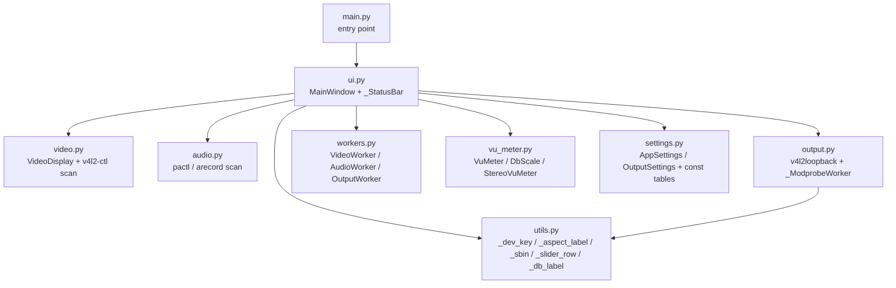
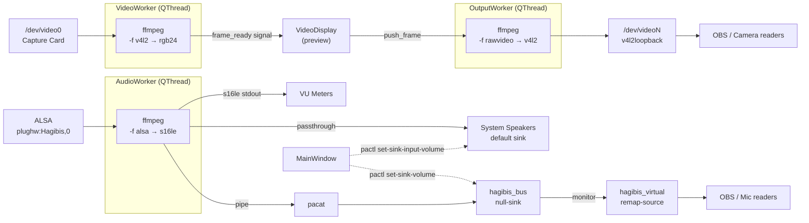

# Hagibis Monitor

A PyQt6 desktop application for live monitoring and control of USB capture
cards on Linux. Originally built around the **Hagibis USB Capture Card**
(MS2130 / MacroSilicon chipset, USB ID `345f:2130`) but works with any
V4L2-compatible capture device.

---


---

## Table of Contents

1. [Hardware context](#hardware-context)
2. [What the app does](#what-the-app-does)
3. [Project layout](#project-layout)
4. [Dependencies](#dependencies)
5. [Running the app](#running-the-app)
6. [UI walkthrough](#ui-walkthrough)
7. [Profiles](#profiles)
8. [Video display options](#video-display-options)
9. [Audio](#audio)
10. [Output (virtual camera + virtual mic)](#output-virtual-camera--virtual-mic)
11. [Known quirks and gotchas](#known-quirks-and-gotchas)
12. [AI context — read this if you are a future assistant](#ai-context--read-this-if-you-are-a-future-assistant)

---

## Hardware context

| Item | Detail |
|---|---|
| Primary device | Hagibis USB Capture Card |
| USB ID | `345f:2130` (MacroSilicon MS2130 chipset) |
| Video node | `/dev/video0` (auto-detected at runtime) |
| V4L2 driver | `uvcvideo` |
| ALSA card | `card 2: Hagibis`, device 0 — `plughw:Hagibis,0` |
| PulseAudio/PipeWire source | auto-detected by name at runtime |
| Supported formats | MJPEG, YUYV 4:2:2 |
| Supported resolutions | 640×480 up to 2560×1440 (queried live from device) |
| Max frame rate | 60 fps at 1920×1080 and below; 30 fps at 2560×1440 |
| V4L2 controls | brightness, contrast, saturation, hue — all 0–100, default 50 |

---

## What the app does

### Video
- **Live video preview** — ffmpeg reads from the selected V4L2 device and
  pipes raw RGB24 frames into a custom `paintEvent`-based display widget.
- **Device selection** — scans all V4L2 devices via `v4l2-ctl --list-devices`;
  click ↻ to rescan without restarting.
- **Dynamic format / resolution / fps** — populated live from
  `v4l2-ctl --list-formats-ext` for the selected device. Resolutions are
  grouped into aspect-ratio tabs (16:9, 4:3, 5:4, 10:9, …).
- **Image controls** — brightness / contrast / saturation / hue sliders
  that call `v4l2-ctl --set-ctrl` in real time.
- **Scale modes** — twelve display modes covering fit, stretch, fill, native,
  and area-constrained variants (see [Video display options](#video-display-options)).
- **Crop modes** — pre-scale centre-crop to full / 10:9 / 5:4 / 4:3.
- **Background colour** — configurable letterbox / pillarbox colour (default `#1f1f1f`).
- **Collapsible panel** — the control panel can be hidden / shown via the ◀ ▶
  toggle strip on its left edge.

### Audio
- **Audio device selection** — scans ALSA capture devices via `arecord -l`;
  click ↻ to rescan.
- **VU meters** — stereo L/R segmented meters with peak hold and 0.4 dB/update
  decay, driven by per-chunk RMS of the raw s16le PCM.
- **Mono Mix** — sums L+R into a mono signal on both channels (useful for
  single-channel console audio). Requires ffmpeg restart to apply.
- **Audio Passthrough** — routes captured audio to the default
  PulseAudio/PipeWire sink using ffmpeg's `asplit` filter. Volume is applied
  in real time via `pactl set-sink-input-volume`.
- **Virtual Microphone** — when Output is enabled, creates a persistent
  PulseAudio virtual source (`hagibis_virtual`) that other apps (e.g. OBS,
  Discord) can use as a microphone input. Volume is applied in real time via
  `pactl set-sink-volume hagibis_bus` without restarting ffmpeg.
- **Master + per-channel volume** — master fader (−40 to +10 dB) and
  independent L/R trims (−20 to +20 dB). VU meters reflect volume changes
  instantly while dragging.

### Output (virtual camera)
- **v4l2loopback virtual camera** — writes the processed video feed to a
  `/dev/videoN` loopback device. OBS and other apps can read from it.
- **Separate output scale / crop** — independent scale mode and crop for the
  loopback output, stored per-profile.
- **Pan / zoom** — adjustable pan and zoom applied to both the preview and the
  loopback output, stored per-profile.
- **Output resolution / format / fps** — configurable globally (not per-profile).
  All standard resolutions are advertised to readers.
- **Persistent virtual source** — the PulseAudio virtual mic modules are kept
  alive across audio worker restarts. OBS never loses the device when volume
  or mono settings change.

### Profiles
- Named profiles stored as individual INI files under
  `~/.config/HagibisMonitor/profiles/`.
- Every UI value is captured in a flat `AppSettings` dataclass.
- Changes are tracked in memory; the **Save Profile** button flushes to disk.
- **Revert** reloads the active profile from disk, discarding in-memory changes.
- Switching profiles with unsaved changes prompts: Discard & Switch / Save &
  Switch / Save as New Profile / Cancel.
- Create (`+`) and delete (`✕`) profiles; Default cannot be deleted.

---

## Project layout

```
hagibis-monitor/
├── main.py       # Entry point — constructs QApplication + MainWindow
├── ui.py         # MainWindow + _StatusBar — all UI construction, profile mgmt, stream orchestration
├── video.py      # VideoDisplay widget + video device scanning / capability querying
├── audio.py      # Audio device scanning (PulseAudio sources → ALSA fallback)
├── output.py     # v4l2loopback discovery / load / unload + _ModprobeWorker
├── settings.py   # AppSettings + OutputSettings dataclasses + resolution/format/fps constant tables
├── utils.py      # Small shared helpers (_dev_key, _aspect_label, _sbin, _slider_row, _db_label)
├── workers.py    # VideoWorker, AudioWorker, OutputWorker (QThread subclasses)
├── vu_meter.py   # VuMeter, DbScale, StereoVuMeter custom widgets
├── .gitignore
└── .vscode/
    └── launch.json   # VS Code debugpy configuration
```

Settings are stored in:
```
~/.config/HagibisMonitor/
├── HagibisMonitor.ini        # window geometry + output settings (global)
└── profiles/
    ├── Default.ini           # always present; created on first launch
    ├── GBC.ini               # example user profile
    └── N64.ini               # example user profile
```

### main.py

Minimal entry point. Creates `QApplication`, sets the `"Fusion"` style,
instantiates `MainWindow` from `ui.py`, shows it, and enters the event loop.
No application logic lives here.

### ui.py

**`MainWindow(QMainWindow)`** — owns every widget and every worker. Builds
the three tabs (Video / Audio / Output), the profile bar, the dark theme,
and the status bar. Holds references to the running `VideoWorker`,
`AudioWorker`, `OutputWorker`, and `_ModprobeWorker`. Manages the dirty
flag and the unsaved-changes dialog.

Key I/O methods:
- `_collect_settings() → AppSettings` — reads every widget into a struct.
- `_apply_settings(s)` — applies a struct to every widget + restarts streams.
- `_load_from_disk(name) → AppSettings` — reads a profile INI file.
- `_save_to_disk(s, name)` — writes a profile INI file atomically via one
  QSettings object (avoids the multi-object sync bug).

**`_StatusBar(QWidget)`** — custom full-width status bar that centres the
`● Audio` / `● Video` output indicators over the video display area, with
the FPS readout pinned to the right.

### video.py

**`VideoDisplay(QLabel)`** — renders frames via `paintEvent` using a
pre-computed `(QPixmap, QPoint)` pair. Supports all twelve scale modes and
four crop modes independently for both display and loopback output. Owns
the pan/zoom state and emits `output_changed(pan_x, pan_y, zoom)` when the
user drags or wheel-scrolls inside the canvas.

**`_scan_video_devices()`** — runs `v4l2-ctl --list-devices`; falls back
to globbing `/dev/video*` if v4l2-ctl is missing.

**`_query_device_caps(dev)`** — runs `v4l2-ctl --list-formats-ext` for one
device and returns a `{format: {label, sizes: {(w, h): [fps, …]}}}` dict.

### audio.py

**`_scan_audio_devices()`** — prefers `pactl list sources` (works under
PipeWire); falls back to `arecord -l` for direct ALSA addressing. Returns
`[(display_label, ffmpeg_address), …]`.

### output.py

**`_find_loopback_devices()`** — walks `/sys/class/video4linux/` looking
for nodes that expose the `max_openers` attribute (or have `v4l2loopback`
in their device path / name). Returns `/dev/videoN` paths.

**`_v4l2loopback_installed()`** — checks for the `.ko` file under the
running kernel or `/sys/module/v4l2loopback`.

**`_load_v4l2loopback()` / `_unload_v4l2loopback()`** — modprobes the
module, falling back to `pkexec` if direct invocation fails. Loads
without `exclusive_caps` so OBS sees the full set of resolutions.

**`_ModprobeWorker(QThread)`** — runs `_load_v4l2loopback()` off the UI
thread; emits `done(device_path, loaded_by_us)`.

### settings.py

**`AppSettings` (dataclass)** — flat struct holding every profile-able value:
scale/crop/bg_color, video device, fmt/res/fps/image controls, audio device,
audio enabled, mono mix, passthrough, three volume levels, output scale/crop
modes, and pan/zoom.

**`OutputSettings` (dataclass)** — globally-stored output settings: enabled
flag, loopback device path, width, height, pixel format, fps. Always starts
disabled on launch regardless of saved state.

Also holds the constant tables used by the UI: `_DEFAULT_RESOLUTIONS`,
`_DEFAULT_FRAMERATES`, `_DEFAULT_FORMATS`, `_OUTPUT_RESOLUTIONS`,
`_OUTPUT_PIXEL_FORMATS`, `_OUTPUT_FPS`.

### utils.py

Tiny shared helpers used by `ui.py` and `output.py`:
- `_dev_key(path)` — sanitises a device path for use as an INI key (legacy
  migration support).
- `_aspect_label(w, h)` — `gcd`-reduced aspect ratio label (with `16:10`
  override for the `8:5` corner case).
- `_sbin(cmd)` — resolves a command that may live in `/usr/sbin` even
  when `PATH` is minimal.
- `_slider_row(lo, hi, val, on_change)` — builds a `(QSlider, QLabel)`
  pair with a value readout, returned as an `(HBoxLayout, slider, label)`
  tuple.
- `_db_label(v)` — formats an int dB value as `"0 dB"` or `"+3 dB"` /
  `"-12 dB"`.

### workers.py

**`VideoWorker(QThread)`**:
- Spawns `ffmpeg -f v4l2 … -f rawvideo -pix_fmt rgb24 -`.
- Reads `width × height × 3` bytes per frame.
- Emits `frame_ready(QImage)` and `fps_updated(float)`.

**`AudioWorker(QThread)`**:
- Spawns ffmpeg reading from `self.device` (ALSA `plughw:` address).
- Without passthrough/virtual: pipes raw s16le PCM to stdout for VU meters.
- With passthrough: `asplit` sends a copy to the default PulseAudio sink.
- With virtual output: `asplit` sends a copy via a pipe to `pacat`, which
  writes to the `hagibis_bus` null-sink. A virtual source (`hagibis_virtual`)
  remaps from `hagibis_bus.monitor` for use by OBS/Discord/etc.
- PA modules (`hagibis_bus` + `hagibis_virtual`) are kept alive across worker
  restarts via `_find_existing_modules()`. `teardown()` must be called
  explicitly to unload them (on output disable or app close).
- Python applies `10^((master_db + channel_trim) / 20)` gain to the stdout
  PCM before RMS computation, giving real-time VU response while dragging.

**`OutputWorker(QThread)`**:
- Spawns `ffmpeg -f rawvideo … -f v4l2 /dev/videoN`.
- Receives frames via `push_frame()` with a drop-newest queue (size 4).
- Uses a monotonic-clock pacing loop to write frames at exactly the target fps.
- Applies pan, zoom, scale mode, and crop mode per frame via QPainter.

### vu_meter.py

`VuMeter(QWidget)`:
- 30 segments, colour-coded: green (< −24 dBFS), yellow-green (−24 to −12),
  orange (−12 to −6), red (−6 to 0).
- Peak hold for 90 updates (~1.4 s), then decays at 0.4 dB per update.

`DbScale(QWidget)` — fixed-width tick/label scale; ticks at 0, −3, −6, −12,
−20, −40, −60 dBFS.

`StereoVuMeter(QWidget)` — L meter / scale / R meter layout; `set_levels(l, r)`.

---

## Dependencies

| Dependency | Purpose | Check |
|---|---|---|
| Python ≥ 3.10 | `X \| Y` union hints, dataclasses | `python3 --version` |
| PyQt6 | GUI framework | `python3 -c "import PyQt6"` |
| numpy | Per-chunk RMS in AudioWorker | `python3 -c "import numpy"` |
| ffmpeg | Video + audio capture pipelines | `which ffmpeg` |
| v4l2-ctl | Device enumeration + image controls | `which v4l2-ctl` |
| arecord | ALSA capture device enumeration | `which arecord` |
| pactl | Real-time volume control + PA module management | `which pactl` |
| pacat | Pipe PCM into PulseAudio sink (virtual mic) | `which pacat` |
| xdg-open | Open config folder button | `which xdg-open` |
| v4l2loopback | Virtual camera device (optional) | `modinfo v4l2loopback` |

Install missing Python packages:
```bash
pip install PyQt6 numpy
```

Install system tools (Debian/Ubuntu):
```bash
sudo apt install ffmpeg v4l2-utils alsa-utils pulseaudio-utils
```

For the virtual camera output feature:
```bash
sudo apt install v4l2loopback-dkms
```

`xdg-open` is part of `xdg-utils`, usually pre-installed on desktop systems.

---

## Running the app

```bash
cd ~/Development/projects/hagibis-monitor
python3 main.py
```

Or press **F5** in VS Code (uses `.vscode/launch.json`).

There is no install step.

---

## UI walkthrough

```
┌──────────────────────────────────────────────────◀┬──────────────────────┐
│                                                   │ Profile: [Default ▾] │
│                                                   │ [+] [✕]              │
│                                                   │ [Save Profile][Revert]│
│                                                   │ [⎆]  ● unsaved       │
│                                                   ├──────────────────────┤
│              Live video preview                   │ [Video][Audio][Output]│
│            (scale + crop applied)                 │ ┌──────────────────┐ │
│                                                   │ │ Capture Settings │ │
│                                                   │ │  Device  ▾  [↻]  │ │
│                                                   │ │  Format  ▾       │ │
│                                                   │ │  [16:9][4:3][5:4]│ │
│                                                   │ │  Resolution ▾    │ │
│                                                   │ │  Frame Rate ▾    │ │
│                                                   │ │  [Apply & Restart]│ │
│                                                   │ └──────────────────┘ │
│                                                   │ ┌──────────────────┐ │
│                                                   │ │ Display          │ │
│                                                   │ │  Scale Mode ▾    │ │
│                                                   │ │  Crop       ▾    │ │
│                                                   │ │  Background ████ │ │
│                                                   │ └──────────────────┘ │
│                                                   │ ┌──────────────────┐ │
│                                                   │ │ Image Controls   │ │
│                                                   │ │  Brightness ━●── │ │
│                                                   │ │  Contrast   ━●── │ │
│                                                   │ │  Saturation ━●── │ │
│                                                   │ │  Hue        ━●── │ │
│                                                   │ │  [Reset Defaults] │ │
│                                                   │ └──────────────────┘ │
├───────────────────────────────────────────────────┴──────────────────────┤
│ Capturing 1280×720 @ 30 fps [MJPEG]  /dev/video0              FPS: 30.0 │
└────────────────────────────────────────────────────────────────────────────┘
```

The ◀ strip on the right edge of the video area collapses/expands the panel.

**Audio tab:**
```
┌──────────────────────────────┐
│ ┌─ Audio Device ───────────┐ │
│ │ [Hagibis — USB ▾]  [↻]  │ │
│ └──────────────────────────┘ │
│ ☑ Enable Audio Monitor       │
│  ┌──┬──┬──┐                  │
│  │▓▓│  │▓▓│  ← L/R meters   │
│  │░░│-6│░░│                  │
│  │  │-20│  │                 │
│  │  │-40│  │                 │
│  │ L│  │R │                  │
│  └──┴──┴──┘                  │
│ ┌─ Audio Options ──────────┐ │
│ │ ☐ Force Mono Mix         │ │
│ │ ☐ Passthrough to System  │ │
│ └──────────────────────────┘ │
│ ┌─ Volume ─────────────────┐ │
│ │ Master: [━━━●━━] 0 dB   │ │
│ │ Left:   [━━━●━━] 0 dB   │ │
│ │ Right:  [━━━●━━] 0 dB   │ │
│ └──────────────────────────┘ │
└──────────────────────────────┘
```

**Output tab:**
```
┌──────────────────────────────┐
│ ☐ Enable Output              │
│ ┌─ Video Device ───────────┐ │
│ │ [/dev/video10 ▾]  [↻][⧉]│ │
│ └──────────────────────────┘ │
│ ┌─ Format ─────────────────┐ │
│ │  [16:9][4:3]…            │ │
│ │  Resolution ▾            │ │
│ │  Pixel Format ▾          │ │
│ │  Frame Rate ▾            │ │
│ └──────────────────────────┘ │
│ ┌─ Scale & Crop ───────────┐ │
│ │  Scale Mode ▾            │ │
│ │  Crop       ▾            │ │
│ └──────────────────────────┘ │
│ ┌─ Pan / Zoom ─────────────┐ │
│ │  X [━━━●━━]  Y [━━━●━━] │ │
│ │  Zoom [━━━●━━]  [Reset]  │ │
│ └──────────────────────────┘ │
│  ● Video  ● Audio            │
└──────────────────────────────┘
```

When output is enabled and v4l2loopback is loaded, the status line at the
bottom shows `● Video` and `● Audio` indicators.

---

## Profiles

Profiles let you save and recall complete configurations — useful when
switching between different sources (e.g. Game Boy Color vs N64).

| Control | Action |
|---|---|
| Profile combo | Switch active profile (prompts if unsaved changes) |
| `+` | Create a new profile from the current settings |
| `✕` | Delete the active profile (Default cannot be deleted) |
| **Save Profile** | Write current in-memory settings to the active profile INI |
| **Revert** | Reload the active profile from disk, discarding pending changes |
| `⎆` | Open the profiles folder in the file manager |
| `● unsaved` | Indicator — visible whenever there are unsaved changes |

When switching away from a profile with unsaved changes, a dialog offers:
- **Discard & Switch** — abandon changes, load the new profile
- **Save & Switch** — flush current changes to disk, then load the new profile
- **Save as New Profile…** — name a new profile, save there, then switch
- **Cancel** — stay on the current profile

Every setting in the UI is profile-aware. The profile is auto-saved when
the app closes, so the last session is always restored.

### What each profile stores

| Category | Settings |
|---|---|
| Display | Panel visible, Scale Mode, Crop, Background Color |
| Capture | Video device, Format, Resolution, Frame Rate |
| Image Controls | Brightness, Contrast, Saturation, Hue |
| Audio | Audio device, Enable monitoring, Mono Mix, Passthrough |
| Volume | Master, Left trim, Right trim |
| Output display | Output Scale Mode, Output Crop |
| Pan / Zoom | Pan X, Pan Y, Zoom (applies to both preview and loopback output) |

Output device, resolution, pixel format, and fps are **global** (not
per-profile). The output enabled state always starts as disabled on launch.

Window size and position are also global (not per-profile).

---

## Video display options

### Scale Mode

| Mode | Description |
|---|---|
| Fit (Keep Aspect) | Letterbox/pillarbox; nothing cropped |
| Stretch to Fill | Fills window, ignores aspect ratio |
| Zoom to Fill (Crop) | Fills window, keeps ratio, crops edges |
| Native (1:1 Pixels) | No scaling; centre-cropped by window edges |
| Fit to 16:9 / 10:9 / 5:4 / 4:3 Area | Constrain to that ratio's sub-rect; video keeps its own ratio inside it |
| Stretch to 16:9 / 10:9 / 5:4 / 4:3 Area | Same sub-rect, but video is stretched to fill it exactly |

The Output tab has its own independent Scale Mode and Crop selection, so the
loopback output can be framed differently from the on-screen preview.

### Crop

Applied **before** scaling. Centre-crops the incoming frame to the target ratio:

| Mode | Removes |
|---|---|
| Full Image | Nothing |
| Crop to 10:9 | Left/right if source is wider than 10:9 |
| Crop to 5:4 | Left/right or top/bottom as needed |
| Crop to 4:3 | Left/right if source is wider than 4:3 |

### Background Color

The colour that fills the letterbox/pillarbox areas and the NO SIGNAL
placeholder. Default: `#1f1f1f`. Click the colour swatch to change.

---

## Audio

### Mono Mix

Some HDMI sources output audio on only one channel. **Force Mono Mix**
applies the ffmpeg `pan` filter:
```
pan=stereo|c0=0.5*c0+0.5*c1|c1=0.5*c0+0.5*c1
```

| Input situation | Result with Mono Mix on |
|---|---|
| Audio on left channel only | Centred on both speakers |
| Audio on right channel only | Centred on both speakers |
| Truly mono (1-ch ALSA) | Duplicated to both speakers |
| Full stereo | Collapsed to centred mono |

Changing Mono Mix restarts ffmpeg. Because the PulseAudio virtual source
modules are kept alive across restarts, OBS does not lose its microphone
device connection during this restart.

### Passthrough & volume

When Passthrough is enabled, ffmpeg uses `asplit` to split the stream:
```
[0:a]<pan?>asplit=2[vu][out]
  → [vu]  s16le → stdout → Python RMS → VU meters
  → [out] pulse → default sink → speakers
```

Speaker volume is controlled in real time via `pactl set-sink-input-volume`
after the ffmpeg sink input is located by PID.

### Virtual Microphone

When **Output** is enabled, a second split is added and `pacat` is used to
pipe PCM into a PulseAudio null-sink (`hagibis_bus`). A virtual source
(`hagibis_virtual`) remaps from its monitor:

```
ffmpeg → pipe → pacat → hagibis_bus (null-sink)
                              ↓ monitor
                       hagibis_virtual (remap-source) → OBS / Discord / …
```

Volume for the virtual mic is controlled in real time via
`pactl set-sink-volume hagibis_bus`, targeting the null-sink directly (more
reliable in PipeWire than setting volume on the virtual source).

The `hagibis_bus` and `hagibis_virtual` PA modules are **persistent** — they
are not unloaded when the audio worker restarts (e.g. when changing Mono Mix
or volume). They are only unloaded when Output is explicitly disabled or the
app closes.

### Volume controls

| Control | Range | Affects |
|---|---|---|
| Master | −40 to +10 dB | Both channels uniformly |
| Left trim | −20 to +20 dB | Left channel only (additive with master) |
| Right trim | −20 to +20 dB | Right channel only (additive with master) |

Dragging any volume slider immediately updates:
- The VU meter display (Python-side gain applied to PCM before RMS)
- The passthrough speaker level (via `pactl set-sink-input-volume`)
- The virtual mic level (via `pactl set-sink-volume hagibis_bus`)

---

## Output (virtual camera + virtual mic)

### Virtual camera

Enabling Output loads `v4l2loopback` (via `modprobe`, using `pkexec` for
privilege escalation if needed) and starts `OutputWorker`, which writes
processed frames to the loopback device at the selected resolution and fps.

The loopback device is loaded without `exclusive_caps`, so it advertises the
full standard set of V4L2 resolutions and formats. OBS and other readers see
all resolutions in their device settings.

When the output resolution is changed, the app:
1. Stops OutputWorker (closes the write side — triggers `V4L2_EVENT_SOURCE_CHANGE` to readers)
2. Waits 150 ms for readers to react
3. Starts a new OutputWorker at the new resolution

OBS handles `V4L2_EVENT_SOURCE_CHANGE` by automatically restarting its
capture pipeline with the updated format.

### Virtual microphone

See [Virtual Microphone](#virtual-microphone) in the Audio section above.

### Output status indicators

The status bar at the bottom of the window shows:

| Indicator | Meaning |
|---|---|
| `● Video` (green) | OutputWorker is running and writing to the loopback device |
| `● Audio` (green) | AudioWorker is running with virtual output enabled |
| Grey / absent | That output is not active |

---

## Known quirks and gotchas

**ALSA device index changes** — `plughw:Hagibis,0` is resolved by card name
so it survives USB reconnects. If the name appears differently, run
`arecord -l` to confirm the short name and update the audio device selection.

**PipeWire blocking ALSA direct access** — `plughw:` uses ALSA directly. If
PipeWire holds exclusive access, ffmpeg will exit immediately and the audio
error label will show the last ffmpeg error line. Switch the audio device to
the PipeWire virtual device from `pactl list short sources` if this happens.

**YUYV at high resolutions is slow** — YUYV is uncompressed; at 1920×1080
the USB bus saturates quickly. Use MJPEG for anything above 720p.

**V4L2 controls apply to the hardware immediately** — slider values written
with `v4l2-ctl` persist in the driver until the device is replugged. The app
re-applies all image control values from the active profile each time a
profile is loaded or the video stream is restarted.

**pactl sink input lookup delay** — after audio starts with passthrough
enabled, the app polls for the ffmpeg sink input every 80 ms for up to ~3 s.
During this window, the speaker volume is at the hardware default (100%).
Once found, all volume slider positions are applied immediately.

**Virtual mic volume applied after 500 ms** — when the audio worker starts
with virtual output enabled, the app waits 500 ms before calling
`pactl set-sink-volume hagibis_bus` to allow pacat time to connect to the
sink. During this window the virtual mic is at 100% volume.

**v4l2loopback requires a kernel module** — if the module is not installed,
enabling Output will show an error. Install `v4l2loopback-dkms` and grant
permission via the `pkexec` prompt. The module is loaded once and left loaded
for the session; the app never unloads it.

**v4l2loopback module loaded with old exclusive_caps** — if the module was
previously loaded with `exclusive_caps=1` (e.g. from a prior session), OBS
will only see one resolution. Reload the module:
```bash
sudo modprobe -r v4l2loopback
# then re-enable Output in the app
```

**60 fps in MJPEG at 1920×1080** — confirmed supported by the Hagibis device.
If the pipeline drops frames, lower the resolution or frame rate.

---

## AI context — read this if you are a future assistant

> This section gives you the full picture so you can contribute without
> re-reading the whole conversation.

### Keep this README up to date

**This README is the canonical context document for the project.** Whenever
you change something that affects how a future assistant should reason about
the code, update the README in the same change. That includes:

- File splits, renames, or new modules → update [Project layout](#project-layout)
  and the per-file sub-sections.
- New `AppSettings` / `OutputSettings` fields → update the [AppSettings fields](#appsettings-fields-current)
  block and the [Profiles](#profiles) "what each profile stores" table.
- New ffmpeg / pactl invocations or worker threads → update
  [Architecture](#architecture) and the relevant worker description.
- New UI tabs, controls, or status indicators → update the
  [UI walkthrough](#ui-walkthrough) and [What the app does](#what-the-app-does).
- New external dependencies → update the [Dependencies](#dependencies) table.
- New design decisions or non-obvious quirks → update [Key design decisions](#key-design-decisions)
  or [Known quirks and gotchas](#known-quirks-and-gotchas).

If a change makes any part of the README stale, fix it in the same commit —
do not leave it for "later." A stale README is worse than a missing one
because future assistants will trust it.

**Always use Mermaid for diagrams.** Any flow, dependency, state machine,
sequence, or architecture diagram added to this README — or to any other
markdown doc in the repo — must be a fenced ```mermaid``` block, never an
ASCII-art box drawing, never an embedded image, and never a link to an
external diagramming tool. Mermaid renders natively on GitHub, stays
diffable in PRs, and can be updated in-place when the underlying code
changes. Examples already in this file: the [Architecture](#architecture)
runtime graph and the [Module dependency graph](#module-dependency-graph).

### What this project is

A PyQt6 GUI monitor for USB capture cards on a Linux desktop. Not a recording
tool — purely live monitoring, image control, optional audio passthrough,
virtual camera output (v4l2loopback), and virtual microphone (PulseAudio).
All settings are organised into named profiles.

### Code organisation

The codebase is split by functional area (see [Project layout](#project-layout)
for the full file tree):

| File | Role |
|---|---|
| `main.py` | Entry point only — `QApplication` + `MainWindow` |
| `ui.py` | `MainWindow` (everything UI-side) + `_StatusBar` |
| `video.py` | `VideoDisplay` widget + V4L2 device scanning / cap query |
| `audio.py` | PulseAudio / ALSA device scanning |
| `output.py` | v4l2loopback discovery / load / unload + `_ModprobeWorker` |
| `settings.py` | `AppSettings` + `OutputSettings` dataclasses + constant tables |
| `utils.py` | Small shared helpers (`_dev_key`, `_aspect_label`, `_sbin`, `_slider_row`, `_db_label`) |
| `workers.py` | `VideoWorker`, `AudioWorker`, `OutputWorker` — all three `QThread` subprocess drivers |
| `vu_meter.py` | `VuMeter`, `DbScale`, `StereoVuMeter` |

`MainWindow` in `ui.py` is intentionally monolithic — it owns every widget
and every worker, and orchestrates profile load/save, stream restarts,
real-time volume application, and the dirty-state dialog. Splitting it
further would require restructuring methods into mixins or per-tab
controllers, which would be a behavioural change rather than reorganisation.

#### Module dependency graph



Notes:
- `workers.py`, `vu_meter.py`, `video.py`, `audio.py`, and `settings.py` have
  no project-local imports — they only depend on PyQt6, numpy, and stdlib.
- Only `ui.py` reaches across modules to wire things together; nothing
  outside `ui.py` depends on `MainWindow`.

### Architecture



Three long-lived ffmpeg subprocesses (video, audio, output); one per worker.
Workers communicate back to the main thread exclusively via Qt signals.

### Settings / profile system

All profile-able state lives in the `AppSettings` dataclass (flat, no nesting).
The three canonical operations are:

```python
settings = _collect_settings()         # UI → struct
_apply_settings(settings)              # struct → UI + restart streams
_save_to_disk(settings, profile_name)  # struct → INI file (single QSettings obj)
settings = _load_from_disk(name)       # INI file → struct
```

Profile INI files live in `~/.config/HagibisMonitor/profiles/`. The main
`HagibisMonitor.ini` stores window geometry and output settings (device,
resolution, pixel format, fps). **Never write profile data to the global
QSettings** — it breaks the profile separation.

Output is always loaded with `enabled=False` regardless of the saved value.

### AppSettings fields (current)

```python
@dataclass
class AppSettings:
    scale_mode: str = "fit"
    crop_mode: str = "full"
    bg_color: str = "#1f1f1f"
    video_device: str = "/dev/video0"
    video_fmt: str = "mjpeg"
    video_res: str = "1280x720"
    video_fps: int = 30
    brightness: int = 50
    contrast: int = 50
    saturation: int = 50
    hue: int = 50
    audio_device: str = "plughw:Hagibis,0"
    audio_enabled: bool = True
    mono_mix: bool = False
    passthrough: bool = False
    volume_db: int = 0
    volume_l_db: int = 0
    volume_r_db: int = 0
    output_scale_mode: str = "fit"
    output_crop_mode: str = "full"
    pan_x: float = 0.0
    pan_y: float = 0.0
    zoom: float = 1.0
```

### Key design decisions

- **ffmpeg, not OpenCV** — OpenCV was not installed; ffmpeg handles MJPEG and
  YUYV without extra libraries.
- **ffmpeg, not sounddevice/pyaudio** — ffmpeg reads ALSA directly and outputs
  raw s16le PCM for numpy.
- **`asplit` for VU + passthrough + virtual** — avoids opening the ALSA device
  multiple times.
- **`plughw:Name,N` not `hw:N,N`** — name-based, survives USB re-enumeration;
  `plughw` allows format conversion via ALSA's plugin layer.
- **pacat for virtual mic** — more reliable than ffmpeg writing directly to
  a named PulseAudio sink.
- **PA modules are persistent** — `hagibis_bus` and `hagibis_virtual` are never
  unloaded by `AudioWorker.run()`. `_find_existing_modules()` reuses them on
  restart. `teardown()` is called explicitly only on output-disable or close.
  This prevents OBS from losing its microphone device on volume/mono changes.
- **`pactl set-sink-volume hagibis_bus`** — more reliable than
  `set-source-volume hagibis_virtual` in PipeWire's PulseAudio compat layer.
  Targeting the null-sink directly ensures the monitor output (and thus the
  virtual source) carries the correct volume.
- **`pactl set-sink-input-volume` for passthrough** — same approach, but
  targeting the ffmpeg sink input found by PID polling.
- **Python-side gain for VU** — `AudioWorker` multiplies raw PCM by the linear
  gain each chunk, so VU meters respond instantly while dragging sliders.
- **`v4l2-ctl` subprocess for image controls** — fire-and-forget `Popen`;
  all values re-applied via `_apply_v4l2_all()` on profile load.
- **`paintEvent` rendering in `VideoDisplay`** — `setPixmap` can only fill
  the full label bounds; using `QPainter.drawPixmap` at a computed `QPoint`
  allows area-constrained scale modes with background colour filling the rest.
- **Single QSettings object per save** — previously, calling helper functions
  that each created their own QSettings object caused sync() to overwrite
  each other. All writes now go through one object before sync().
- **In-memory dirty tracking** — changes update `self._dirty` but do not write
  to disk. Explicit Save / close-event saves flush to disk. This prevents
  accidental profile corruption while experimenting.
- **v4l2loopback without `exclusive_caps`** — loaded without `exclusive_caps=1`
  so OBS and other readers see all standard V4L2 resolutions in their device
  settings, not just the one currently being written.
- **150 ms gap on output resolution change** — `_restart_output()` stops the
  OutputWorker, waits 150 ms (for OBS to process `V4L2_EVENT_SOURCE_CHANGE`),
  then starts a new worker at the new resolution.

### Things not yet implemented

- Auto-detecting the PulseAudio source name for audio passthrough (currently
  uses `plughw:` ALSA direct; switch to a PipeWire virtual device if blocked).
- Recording / snapshot functionality.
- Detection of whether the capture card is actually sending a valid signal.
- Appearance/theming tab.

### Hardware constants (defaults, all overridable via UI)

```python
AppSettings.video_device  = "/dev/video0"
AppSettings.audio_device  = "plughw:Hagibis,0"
AudioWorker.SAMPLE_RATE   = 48000
AudioWorker.CHUNK_FRAMES  = 1024
AudioWorker.BUS_SINK      = "hagibis_bus"
AudioWorker.SOURCE_NAME   = "hagibis_virtual"
```

### How to restart streams from code

```python
win._restart_video()   # stops VideoWorker, starts fresh with current cap_params()
win._start_audio()     # stops AudioWorker, starts fresh with current UI state
win._restart_output()  # stops OutputWorker, waits 150 ms, starts fresh
win._apply_v4l2_all()  # re-applies all image control sliders to hardware
```

### How to load / save a profile from code

```python
s = win._load_from_disk("GBC")   # read GBC.ini → AppSettings
win._apply_settings(s)           # apply to UI + restart streams
win._save_to_disk(win._collect_settings(), "GBC")  # write current UI → GBC.ini
```
